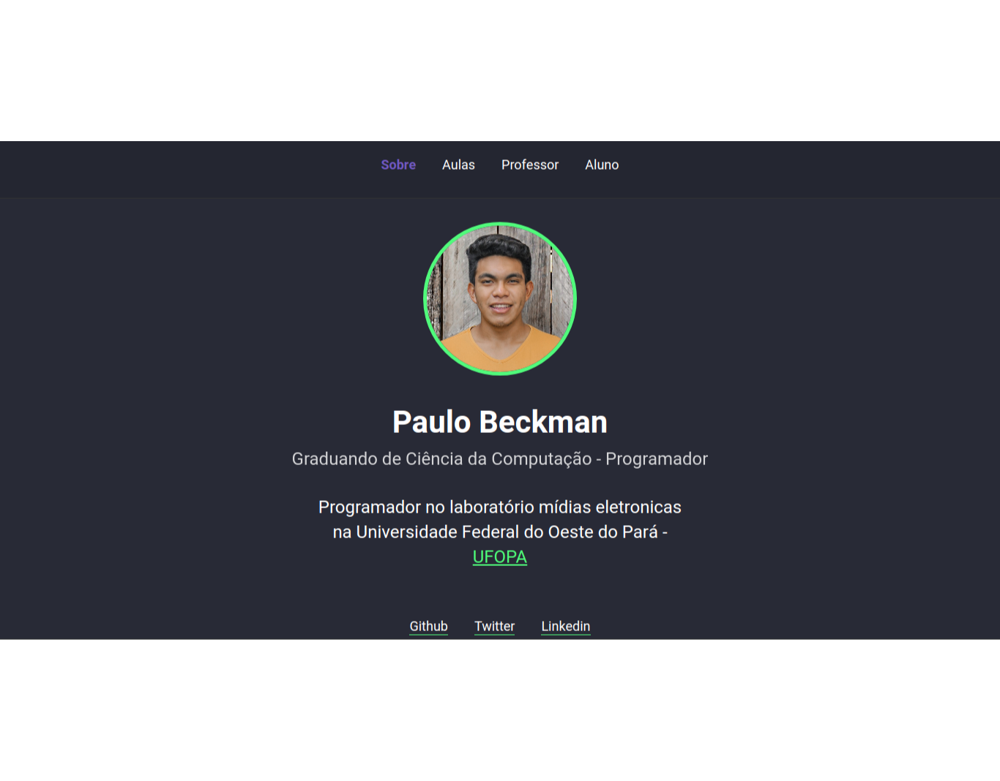
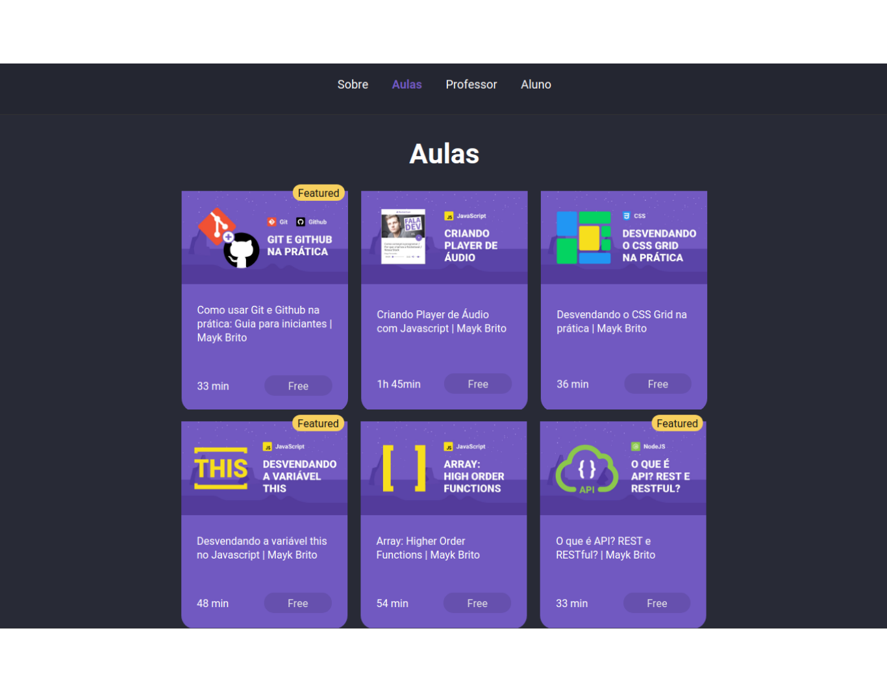
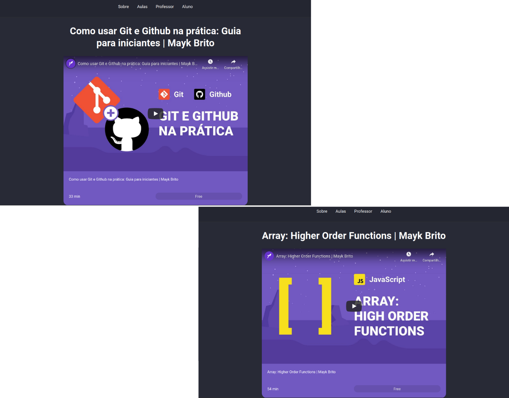
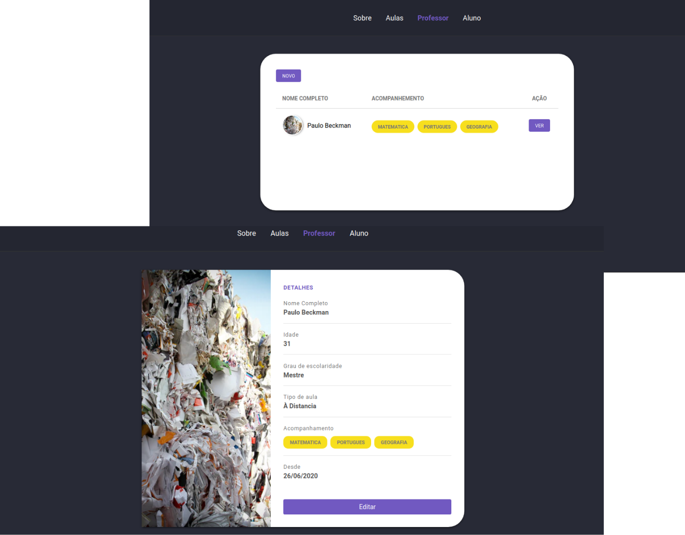
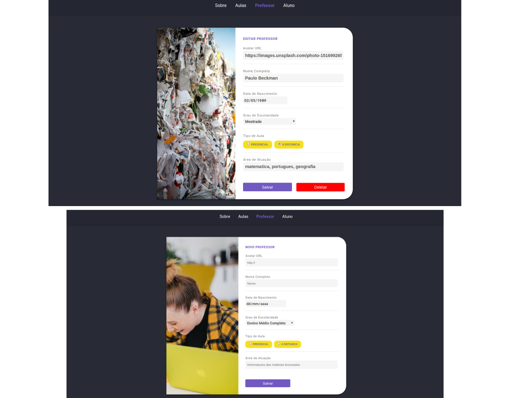
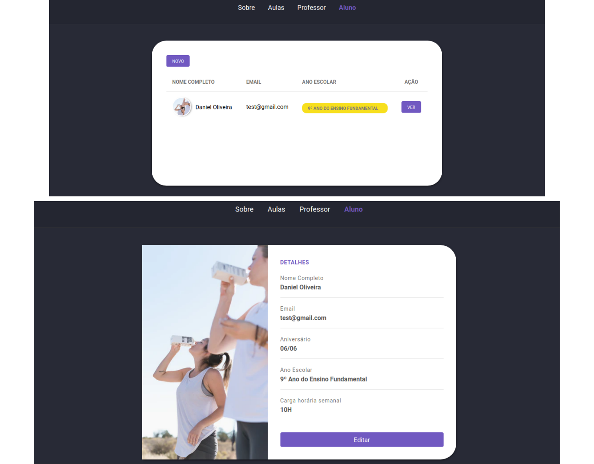
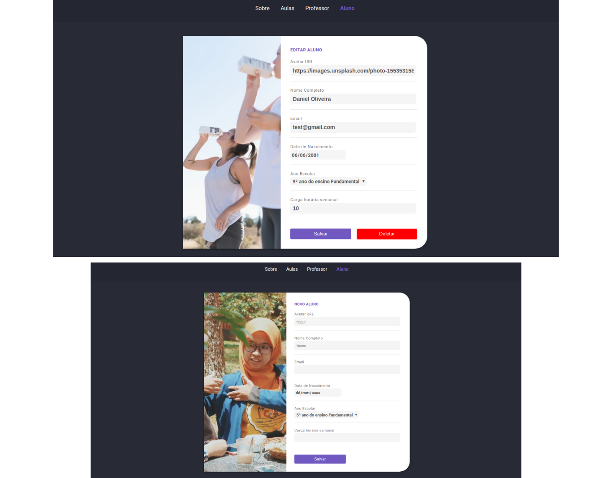

<h1 align="center">
    Class-website
</h1>
 
<h4 align="center"> 
	▶ Class-website ▶
</h4>

<p align="center">
  

  

  	
  <a href="https://www.linkedin.com/in/paulobeckman/">
    
  </a>
	
  
  <a href="https://github.com/paulobeckman/rocketseat-courses/commits/master">
    
  </a>

  
   <a href="https://github.com/paulobeckman/Class-website/stargazers">
    
  </a>
</p>


## 💻 Sobre o projeto

▶ Class website - apresenta as informações sobre um aluno, além de poder redirecionar para todas as redes sociais dele. Além disso, o site conta com um sistema de cadastro de Professores e alunos, afim de ter um melhor controle sobre os alunos e professores da instituição.


Na aba Sobre:
 - O usuário poderá ser redirecionado para acessar o GitHub, LinkedIn e Twitter do aluno.
 
 
 
 
Na aba Aulas:
- o aluno tem acesso a seis cards referentes a vídeos do youtube da [Rocketseat](rs);
- cada card tem uma thumbnail, título, tempo de duração e se o curso e pago ou gratuito;
- ao clicar em cada card, o usuário irá para uma página dedicada para aquele vídeo escolhido, com url específica. Nessa página o usuário pode assitir o vídeo.


Na aba Professor:
 - Os professores poderão se cadastrar na plataforma web enviando:
   - url de uma imagem 
   - seu nome completo
   - data de nascimento
   - grau de Escolaridade
   - tipo de aula
   - área de atuação


Na aba Aluno:
 - Os alunos poderão se cadastrar na plataforma web enviando:
   - url de uma imagem 
   - seu nome completo
   - email
   - data de nascimento
   - ano escolar
   - carga horária semanal

Além de fazer cadastro o sistema permite visualizar os dados, fazer edição e deletar. 

Projeto desenvolvido no curso **LaunchBase** oferecida pela [Rocketseat](rs).
"O [LaunchBase](lb) é um treinamento no formato de bootcamp online que tem duração de 8 semanas. A cada semana os conteúdos são liberados de acordo com um cronograma, guiando o aluno pelas ferramentas e conceitos mais modernos de desenvolvimento que permitirão construir as melhores aplicações e ter acesso às melhores oportunidades como programador." - Rocketseat


### Web

<p align="center" style="display: flex; align-items: flex-start; justify-content: center;">
	
 

  

  
  
  
  
  
  
  
  
  
  
  
  
</p>

## 🛠 Tecnologias

As seguintes ferramentas foram usadas na construção do projeto:

- [Node.js][nodejs]
- [Java Script][js]
- [CSS][CSS]
- [HTML][HTML]
- [Nunjucks][Nunjucks]
- [Unsplash Source][API]


## 🚀 Como rodar este projeto
 
Podemos considerar este projeto como sendo divido em duas partes:
1. Back End (arquivos server.js, routes.js, data.js, data.json, utils.js e pasta controllers) 
2. Front End (pasta views e pasta public)

💡O Front End presisa que o Back End esteja sendo executado para funcionar.

### Pré-requisitos

Antes de começar, você vai precisar ter instalado em sua máquina as seguintes ferramentas:
[Git](https://git-scm.com), [Node.js][nodejs]. 
Além disto é bom ter um editor para trabalhar com o código como [VSCode][vscode]

### 🧭 Rodando a aplicação web (Front End)

```bash
# Clone este repositório
$ git clone https://github.com/paulobeckman/Class-website.git

# Acesse a pasta do projeto no terminal/cmd
$ cd Class-website

# Instale as dependências
$ npm install

# Execute a aplicação em modo de desenvolvimento
$ npm start

# O servidor inciará na porta:3000 - acesse http://localhost:3000
```


## 📝 Licença

Este projeto esta sobe a licença MIT. Veja a [LICENÇA](license) para saber mais.

Feito por Paulo Beckman 👋🏽 [Entre em contato!](https://www.linkedin.com/in/paulobeckman/)

[nodejs]: https://nodejs.org/
[vscode]: https://code.visualstudio.com/
[vceditconfig]: https://marketplace.visualstudio.com/items?itemName=EditorConfig.EditorConfig
[license]: https://opensource.org/licenses/MIT
[rs]: https://rocketseat.com.br
[lb]: https://pages.rocketseat.com.br/launchbase/inscricao/5
[js]: https://developer.mozilla.org/pt-BR/docs/Aprender/JavaScript
[CSS]: https://developer.mozilla.org/pt-BR/docs/Web/CSS
[HTML]: https://developer.mozilla.org/pt-BR/docs/Web/HTML
[v1]: https://github.com/paulobeckman/web-information-and-videos
[Nunjucks]: https://www.npmjs.com/package/nunjucks
[API]: https://source.unsplash.com/

